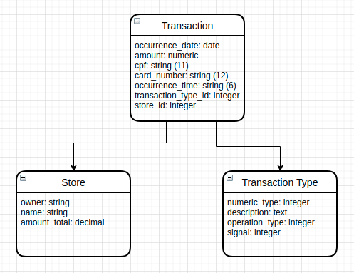

# Configuração do projeto

## Importando dados de arquivo .txt

## Dependência
- Docker >= v20.10.5

## Projetos desenvolvidos com:
#### Microsserviço:
- Ruby v3.0.1
- Rails v6.1.3.1

## Executando o microsserviço:

Abra o terminal na raiz do projeto e entre pasta `microservice`:

`cd microservice`

Executar comando para construir os projeto back-end:

`sudo docker-compose build`

Executar o comando para inicializar:

`sudo docker-compose up -d`

Executar o comando para criar o banco de dados:

`sudo docker-compose exec api rake db:create`

Executar o comando para migrar o banco de dados:

`sudo docker-compose exec api rake db:migrate`

Executar o comando para efetuar o pré cadastro dos tipos de transações:

`sudo docker-compose exec api rake db:seed`

## Rodando os testes automatizados

Execute o comando:

`sudo docker-compose exec api bundle exec rspec`

## Acessar o container

`docker exec -it microservice_api_1 bash`

# Documentação do CNAB

| Descrição do campo  | Inicio | Fim | Tamanho | Comentário
| ------------- | ------------- | -----| ---- | ------
| Tipo  | 1  | 1 | 1 | Tipo da transação
| Data  | 2  | 9 | 8 | Data da ocorrência
| Valor | 10 | 19 | 10 | Valor da movimentação. *Obs.* O valor encontrado no arquivo precisa ser divido por cem(valor / 100.00) para normalizá-lo.
| CPF | 20 | 30 | 11 | CPF do beneficiário
| Cartão | 31 | 42 | 12 | Cartão utilizado na transação 
| Hora  | 43 | 48 | 6 | Hora da ocorrência atendendo ao fuso de UTC-3
| Dono da loja | 49 | 62 | 14 | Nome do representante da loja
| Nome loja | 63 | 81 | 19 | Nome da loja

# Documentação sobre os tipos das transações

| Tipo | Descrição | Natureza | Sinal |
| ---- | -------- | --------- | ----- |
| 1 | Débito | Entrada | + |
| 2 | Boleto | Saída | - |
| 3 | Financiamento | Saída | - |
| 4 | Crédito | Entrada | + |
| 5 | Recebimento Empréstimo | Entrada | + |
| 6 | Vendas | Entrada | + |
| 7 | Recebimento TED | Entrada | + |
| 8 | Recebimento DOC | Entrada | + |
| 9 | Aluguel | Saída | - |

## Diagrama de classes

